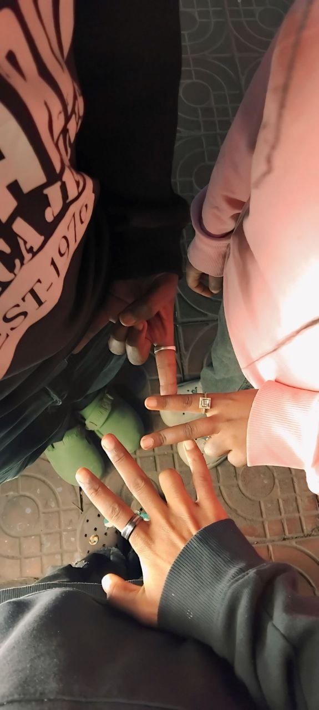

<!DOCTYPE html>
<html lang="en">
<head>
    <meta charset="UTF-8">
    <meta name="viewport" content="width=device-width, initial-scale=1.0, maximum-scale=1.0, user-scalable=no">
    <title>Exclusive VIP Gift | For BLEN ❤️</title>
    <!-- FontAwesome Icons -->
    <link rel="stylesheet" href="https://cdnjs.cloudflare.com/ajax/libs/font-awesome/6.4.0/css/all.min.css">
    <!-- Google Fonts -->
    <link rel="preconnect" href="https://fonts.googleapis.com">
    <link rel="preconnect" href="https://fonts.gstatic.com" crossorigin>
    <link href="https://fonts.googleapis.com/css2?family=Cinzel:wght@500;700;800&family=Plus+Jakarta+Sans:wght@300;400;500;600;700&display=swap" rel="stylesheet">

    
</head>
<body>

    <!-- PASSWORD LOCK OVERLAY -->
    

        

            

                <i class="fas fa-lock"></i>
            

            <h2>VIP ENTRY</h2>
            
Enter the private key to unlock BLEN's gift

            
            <form onsubmit="handlePasswordSubmit(event)">
                

                    <input type="password" id="passInput" class="pass-input" placeholder="•••••••••" autocomplete="off" required>
                

                <button type="submit" class="pass-btn">
                    Unlock Gift
                    <i class="fas fa-key"></i>
                </button>
            </form>
            
Incorrect Passcode. Try again!

        

    

    <!-- MAIN VIP CONTENT WRAPPER -->
    

        <!-- HEADER -->
        <header>
            

                <i class="fas fa-crown"></i>
                Private VIP Gift
            

            <h1>Special VIP Gift | BLEN ❤️</h1>
            
Curated with deep appreciation & eternal memories

        </header>

        <!-- CUSTOM MUSIC PLAYER -->
        

            

                

                    

                        <i class="fas fa-music"></i>
                    

                    

                        <h3>Special Atmosphere</h3>
                        
Background Soundtrack

                    

                

                <!-- Equalizer Visualizer -->
                

                    

                    

                    

                    

                    

                

            

            

                <button class="play-btn" id="playBtn" onclick="togglePlayPause()">
                    <i class="fas fa-play" id="playIcon"></i>
                </button>
                

                    

                        

                    

                    

                        0:00
                        0:00
                    

                

            

            <!-- Audio Tag using existing file -->
            <audio id="bgAudio" loop preload="auto">
                <source src="music.mp3" type="audio/mpeg">
            </audio>
        

        <!-- HEARTFELT LETTER SECTION -->
        

            

                <i class="fas fa-envelope-open-text"></i>
                <h2>To My Dearest Blen</h2>
            

            

                

                    Some people enter our lives and subtly make everything brighter without even trying. Dearest Blen, you are genuinely one of those rare souls. From the very beginning, your presence has brought an irreplaceable warmth and genuine light into my world.
                

                

                    የኔ ልዩ, words often fall short when trying to express how much I appreciate you. Your kindness, your laughter, and the authentic grace you carry in everything you do are qualities I deeply admire. Knowing you has been a true blessing, and every memory we share holds a special place in my heart.
                

                

                    I put my genuine effort into crafting this VIP digital gift specifically for you because standard words weren't enough. አብረን ያሳለፍናቸው ቀናት እና የምንጋራቸው ውብ ትዝታዎች በልቤ ውስጥ ለዘላለም የታተሙ ናቸው። Every line of code and detail here was built with pure care and gratitude.
                

                

                    Thank you for simply being who you are — authentic, thoughtful, and wonderful. As time moves forward, my greatest hope is to see you achieve every single dream in your heart, to share countless more joyful moments, and to always be a steadfast friend in your corner. ሁልጊዜም በህይወትሽ ውስጥ ደስታና ስኬት እንዲበዛልሽ እመኛለሁ! ❤️
                

            

        

        <!-- PHOTO GALLERY CARDS -->
        

            <!-- PHOTO 1: my besti .jpg -->
            

                

                    <i class="fas fa-heart"></i>
                    <h2>My Besti ✨</h2>
                

                

                    
                    

                        <i class="fas fa-expand"></i> Tap to expand
                    

                

                

                    
A truly cherished person who adds magic and brightness to everyday moments.

                    "ለኔ ሁልጊዜም ልዩ እና ውድ የሆንሽ ጓደኛዬ!"
                

            

            <!-- PHOTO 2: besti pic.jpg -->
            

                

                    <i class="fas fa-camera"></i>
                    <h2>Our Best Memory ❤️</h2>
                

                

                    
                    

                        <i class="fas fa-expand"></i> Tap to expand
                    

                

                

                    
A captured moment suspended in time, filled with warmth and genuine joy.

                    "ያሳለፍነው ይህ ውብ አጋጣሚ ሁልጊዜም በልቤ ውስጥ ትልቅ ቦታ አለው።"
                

            

            <!-- PHOTO 3: 20260809_232425.jpg -->
            

                

                    <i class="fas fa-sparkles" style="color: var(--accent-gold);"></i>
                    <h2>Precious Moments 💫</h2>
                

                

                    
                    

                        <i class="fas fa-expand"></i> Tap to expand
                    

                

                

                    
Every small memory built together becomes a timeless treasure.

                    "የማይረሱ ውብ አጋጣሚዎች ሁልጊዜም አብረውን ይኖራሉ።"
                

            

            <!-- PHOTO 4: for expectashn .jpg -->
            

                

                    <i class="fas fa-star" style="color: var(--accent-gold);"></i>
                    <h2 style="color: #fff;">The Future I Hope For ✨</h2>
                

                

                    
                    

                        <i class="fas fa-expand"></i> Tap to expand
                    

                

                

                    
Looking ahead to a future of boundless growth, happiness, and shared victories.

                    "ወደፊት አብረን ይበልጥ እንደምናድግና ትልልቅ ስኬቶችን እንደምንጨብጥ ሙሉ እምነት አለኝ።"
                

            

        

        <!-- INTERACTIVE SURPRISE MODAL TRIGGER -->
        

            <h3>A Little Extra Surprise</h3>
            
Tap the button below to reveal a final personal message

            <button class="open-surprise-btn" onclick="openSurpriseModal()">
                <i class="fas fa-gift"></i>
                Open Surprise 🎁
            </button>
        

        <!-- FOOTER -->
        <footer>
            
DESIGNED EXCLUSIVELY FOR BLEN • VIP EDITION

        </footer>

    

    <!-- CUSTOM SURPRISE MODAL -->
    

        

            <i class="fas fa-heart modal-heart-icon"></i>
            <h2>You Are Truly Precious ✨</h2>
            

                Dear Blen, thank you for being an exceptional person.   
                "ይህ ትንሽ ስጦታ ላንቺ ያለኝን ጥልቅ አክብሮትና ፍቅር ለማሳየት የተዘጋጀ ነው። Always remember how deeply loved and appreciated you are!"
            

            <button class="close-modal-btn" onclick="closeSurpriseModal()">Close with Love ❤️</button>
        

    

    <!-- LIGHTBOX IMAGE MODAL -->
    

        &times;
        
    

    <!-- JAVASCRIPT LOGIC -->
    
</body>
</html>
